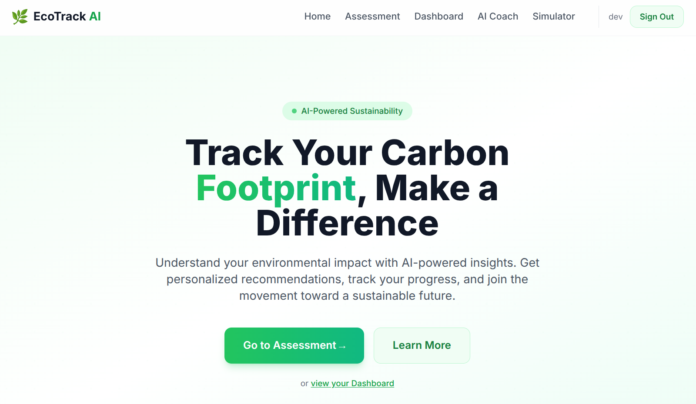
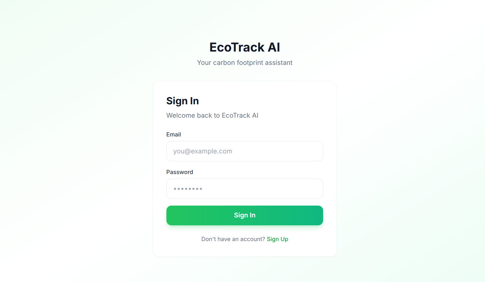
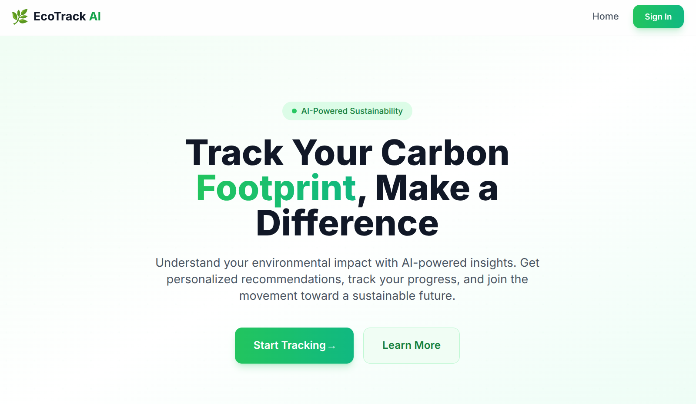
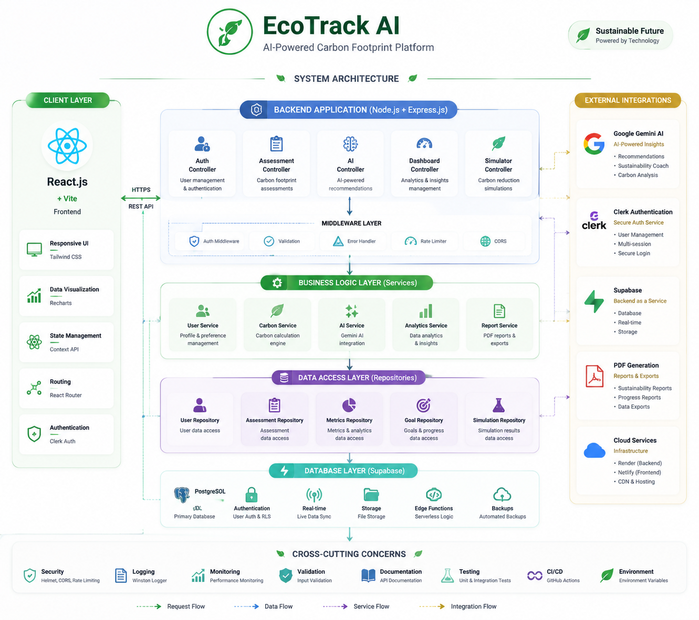

# 🌿 EcoTrack AI — Personal Carbon Footprint Assistant

> **Understand. Track. Reduce.** — An AI-powered sustainability platform that helps you measure, monitor, and minimize your environmental impact.

[](https://ecotrack0a.netlify.app)
[](https://ecotrack-ai-tdq4.onrender.com/api/health)
[](#-testing)
[](#-ai-integration)
[](#-license)

---

## 📖 Problem Statement

Climate change is the defining challenge of our generation, yet most people have no idea what their personal carbon footprint looks like. Existing tools are either too complex, too generic, or lack actionable insights.

**EcoTrack AI** solves this by combining a simple 5-question assessment with AI-powered coaching to give users a personalized, actionable sustainability plan.

### The Challenge

> _"Carbon Footprint Awareness Platform"_ — Help users **understand**, **track**, and **reduce** their carbon emissions.

### How EcoTrack AI Addresses Each Pillar

| Pillar         | EcoTrack AI Feature                                                                        |
| -------------- | ------------------------------------------------------------------------------------------ |
| **Understand** | One-click assessment with real-time carbon scoring and category breakdown                  |
| **Track**      | Interactive dashboard with score history, progress metrics, and trend analysis             |
| **Reduce**     | AI recommendations, Carbon Reduction Simulator, Sustainability Goals, and AI Climate Coach |

---

## 🚀 Live Demo

| Page          | URL                                                      | Description                                   |
| ------------- | -------------------------------------------------------- | --------------------------------------------- |
| 🏠 Home       | [ecotrack0a.netlify.app](https://ecotrack0a.netlify.app) | Landing page with feature overview            |
| 📝 Assessment | [/assessment](https://ecotrack0a.netlify.app/assessment) | 5-question carbon footprint calculator        |
| 📊 Dashboard  | [/dashboard](https://ecotrack0a.netlify.app/dashboard)   | Score history, charts, recommendations, goals |
| 🤖 AI Coach   | [/coach](https://ecotrack0a.netlify.app/coach)           | Chat with Gemini AI sustainability coach      |
| 🔬 Simulator  | [/simulator](https://ecotrack0a.netlify.app/simulator)   | Compare current vs target lifestyle           |

---

## 📸 Screenshots

| Page                                                           | Preview                                                                              |
| -------------------------------------------------------------- | ------------------------------------------------------------------------------------ |
| 🏠 **Home** — Landing page with hero, features grid, and CTA   |          |
| 🔐 **Sign In** — Secure authentication with Supabase Auth      |     |
| 📝 **Assessment (protected)** — 5-step carbon footprint wizard |  |

> 📊 **Dashboard**, **AI Coach**, **Simulator**, and **PDF Report** require authentication. [Try the live demo](https://ecotrack0a.netlify.app) to see them in action.

---

## ✨ Features

### 🧮 Carbon Assessment

- **5-Step Wizard** — Transport, Electricity, Diet, Flights, Shopping
- **Live Scoring** — Real-time carbon score updates as you answer
- **XP Gamification** — Earn experience points for completing steps
- **Smart Validation** — Input validation with helpful tips per category

### 📊 Dashboard

- **Carbon Score Card** — Visual score with level classification (Low / Moderate / High)
- **Emission Breakdown** — Interactive pie chart showing category contributions
- **Progress Tracking** — Month-over-month comparison with reduction percentage
- **Score History** — Timeline of all assessments with trend analysis

### 🤖 AI Climate Coach

- **Real-time Chat** — Conversational AI powered by Google Gemini 2.0 Flash
- **Personalized Context** — AI receives your carbon data for tailored advice
- **Conversation History** — Maintains chat context across messages
- **Markdown Rendering** — Rich formatted responses with React Markdown
- **Quick Suggestions** — Pre-built prompts for common sustainability questions
- **Graceful Fallback** — Cached tips when Gemini API is unavailable

### 🔬 Carbon Reduction Simulator

- **Before/After Comparison** — Side-by-side lifestyle comparison
- **Category-Level Savings** — See exactly where you can save CO₂
- **Annual Projections** — Monthly and annual reduction estimates
- **Level Change Detection** — Alerts when you cross carbon level thresholds

### 🎯 Sustainability Goals

- **Goal Templates** — Pre-built goals for transport, energy, diet, flights, shopping
- **Custom Goals** — Create your own sustainability targets
- **Progress Bar** — Visual progress tracking across all goals
- **Completion Tracking** — Mark goals as done and track achievement rate

### 📄 PDF Sustainability Report

- **Downloadable Report** — Professional PDF with carbon score, breakdown, history, and recommendations
- **Client-Side Generation** — Uses jsPDF for fast, secure report creation
- **Styled Layout** — Color-coded bars, tables, and formatted recommendations

---

## 🏗️ Architecture

<p align="center">
  
</p>

```
┌─────────────────────────────────────────────────────────┐
│                    Frontend (React + Vite)                │
│  ┌──────────┐  ┌──────────┐  ┌───────────────────────┐  │
│  │  Pages   │  │Components│  │  Services (axios)     │  │
│  │  (Lazy)  │  │  (Memo)  │  │  - API Client         │  │
│  │          │  │          │  │  - Supabase Auth       │  │
│  │ Home     │  │ ScoreCard│  │                       │  │
│  │ Auth×2   │  │ Chart    │  │                       │  │
│  │ Assess   │  │ Goals    │  │                       │  │
│  │ Dashboard│  │ Skeleton │  │                       │  │
│  │ Coach    │  │ PDF      │  │                       │  │
│  │ Simulator│  │ Navbar   │  │                       │  │
│  └──────────┘  └──────────┘  └───────────────────────┘  │
│         │ React.lazy + Suspense                          │
│         │ React.memo (charts, cards)                     │
└─────────┼───────────────────────────────────────────────┘
          │ HTTPS (axios + JWT interceptor)
┌─────────┼───────────────────────────────────────────────┐
│              Backend (Node.js + Express.js)              │
│                                                          │
│  Routes → Controllers → Services → Database / AI         │
│                                                          │
│  ┌──────────────┐  ┌──────────────┐  ┌──────────────┐  │
│  │  Middleware   │  │  Controllers │  │   Services   │  │
│  │ - Auth (JWT)  │  │ - Assessment │  │ - Calculator │  │
│  │ - Rate Limit  │  │ - Dashboard  │  │ - Gemini AI  │  │
│  │ - Validation  │  │ - AI Analyze │  │ - Coach AI   │  │
│  │ - Error Handle│  │ - Coach      │  │ - Supabase   │  │
│  │ - CORS        │  │ - Simulator  │  │ - Report     │  │
│  │               │  │ - Report     │  │              │  │
│  └──────────────┘  └──────────────┘  └──────────────┘  │
└─────────┬───────────────────────────────────────────────┘
          │
    ┌─────┴──────┐
    │            │
┌───▼─────┐ ┌───▼────────┐
│Supabase │ │  Google    │
│PostgreSQL│ │  Gemini    │
│+ Auth   │ │  2.0 Flash │
│+ RLS    │ │            │
└─────────┘ └────────────┘
```

### Design Decisions

| Decision             | Choice                     | Rationale                                |
| -------------------- | -------------------------- | ---------------------------------------- |
| Frontend Framework   | React 18 + Vite            | Fast HMR, lazy loading, modern tooling   |
| Styling              | Tailwind CSS               | Rapid UI development, consistent design  |
| State Management     | React Context + useState   | Lightweight, no extra dependencies       |
| Backend Architecture | Controller-Service         | Clean separation of concerns             |
| Database             | Supabase (PostgreSQL)      | Managed, RLS, built-in auth              |
| AI Provider          | Google Gemini 2.0 Flash    | Fast, free tier, good for sustainability |
| Auth                 | Supabase Auth + JWT        | Integrated with database RLS             |
| Testing              | Jest + Supertest (backend) | Industry standard for Node.js APIs       |

---

## 🔧 Tech Stack

| Layer          | Technology                  | Purpose                          |
| -------------- | --------------------------- | -------------------------------- |
| **Frontend**   | React 18 + Vite             | SPA with code splitting          |
| **Styling**    | Tailwind CSS                | Utility-first CSS                |
| **Charts**     | Recharts                    | Interactive pie charts           |
| **PDF**        | jsPDF                       | Client-side report generation    |
| **Markdown**   | React Markdown + remark-gfm | AI response rendering            |
| **Backend**    | Node.js + Express.js        | REST API                         |
| **Database**   | Supabase (PostgreSQL)       | Managed database + auth          |
| **AI**         | Google Gemini 2.0 Flash     | Recommendations + coaching       |
| **Testing**    | Jest + Supertest            | Backend unit + integration tests |
| **Linting**    | ESLint + Prettier           | Code quality                     |
| **Deployment** | Netlify + Render            | Frontend + backend hosting       |

---

## 🧠 AI Integration

EcoTrack AI uses Google Gemini 2.0 Flash in two key features:

### 1. Assessment Analysis

```
User completes assessment
  → Backend calculates carbon score
  → Gemini analyzes lifestyle data
  → Generates personalized recommendations
  → Saves to Supabase for dashboard display
```

### 2. AI Climate Coach

```
User sends message in chat
  → Backend fetches latest assessment data
  → Injects carbon context into Gemini prompt
  → Maintains conversation history (last 6 messages)
  → Returns personalized, context-aware response
```

### Graceful Fallback

When Gemini API is unavailable (quota limits, network issues), both features provide **data-driven cached recommendations** based on the user's actual carbon data — not generic advice.

---

## 🧪 Testing

### Backend Tests (52 tests)

```bash
cd backend && npm test
```

| Test File            | Tests  | Coverage                                           |
| -------------------- | ------ | -------------------------------------------------- |
| `calculator.test.js` | 10     | All diet types, edge cases, level classification   |
| `api.test.js`        | 15     | Validation, auth gates, 404, health check          |
| `simulator.test.js`  | 12     | Unit tests (savings calculation) + API integration |
| `coach.test.js`      | 12     | Auth gates + mocked full flow (Supabase + Gemini)  |
| `dashboard.test.js`  | 3      | Auth gate edge cases                               |
| **Total**            | **52** | **100% pass rate**                                 |

### Frontend Tests

```bash
cd frontend && npm test
```

| Test File                  | Tests | Coverage                                |
| -------------------------- | ----- | --------------------------------------- |
| `CarbonScoreCard.test.jsx` | 3     | Renders score, level, breakdown         |
| `GoalsSection.test.jsx`    | 4     | Renders, adds goals, toggles completion |
| `LoadingSpinner.test.jsx`  | 4     | Renders, accepts size/color props       |

### What We Test

- ✅ Carbon calculator (all inputs, edge cases, diet types)
- ✅ API validation (missing fields, wrong types)
- ✅ Authentication gates (no token, invalid token, expired token)
- ✅ Mocked AI flows (Supabase + Gemini mocked in tests)
- ✅ Simulator savings calculation (unit + integration)
- ✅ React component rendering (props, interactions)

---

## 📁 Project Structure

```
e2e-track/
├── backend/
│   ├── src/
│   │   ├── config/          # Supabase client setup
│   │   ├── controllers/     # Route handlers (business logic)
│   │   ├── middleware/       # Auth, CORS, rate limiting, errors
│   │   ├── routes/          # Express route definitions
│   │   ├── services/        # Calculator, AI, DB, Coach services
│   │   ├── utils/           # Logger
│   │   └── validations/     # express-validator rules
│   ├── tests/               # Jest + Supertest
│   └── supabase-migration.sql
├── frontend/
│   ├── src/
│   │   ├── components/      # Reusable UI (memoized)
│   │   ├── context/         # AuthContext (Supabase Auth)
│   │   ├── layouts/         # Auth/Root layouts
│   │   ├── pages/           # Route pages (lazy-loaded)
│   │   ├── services/        # API client (axios)
│   │   ├── test/            # Vitest setup
│   │   └── utils/           # Toast notifications
│   └── public/
├── docs/                    # Architecture, API ref, schema
├── context/                 # Project management docs
└── README.md
```

---

## 🚀 Quick Start

### Prerequisites

- Node.js 18+
- npm
- Supabase project (free tier works)
- Google Gemini API key

### 1. Clone & Install

```bash
git clone https://github.com/pranjal2410719/EcoTrack-AI-.git
cd EcoTrack-AI-

# Install dependencies
cd backend && npm install
cd ../frontend && npm install
```

### 2. Environment Variables

**Backend** (`backend/.env`):

```env
PORT=5001
SUPABASE_URL=your_supabase_url
SUPABASE_ANON_KEY=your_supabase_anon_key
GEMINI_API_KEY=your_gemini_api_key
FRONTEND_URL=http://localhost:5173
```

**Frontend** (`frontend/.env`):

```env
VITE_SUPABASE_URL=your_supabase_url
VITE_SUPABASE_ANON_KEY=your_supabase_anon_key
VITE_API_URL=http://localhost:5001/api
```

### 3. Database Setup

Run `backend/supabase-migration.sql` in your Supabase SQL Editor to create tables, indexes, and RLS policies.

### 4. Run the App

```bash
# Terminal 1 — Backend
cd backend && npm run dev

# Terminal 2 — Frontend
cd frontend && npm run dev
```

Open **[http://localhost:5173](http://localhost:5173)**

---

## 📡 API Endpoints

| Method | Endpoint          | Auth | Description                            |
| ------ | ----------------- | ---- | -------------------------------------- |
| GET    | `/api/health`     | ❌   | Health check                           |
| POST   | `/api/calculate`  | ❌   | Calculate carbon score (no DB)         |
| POST   | `/api/assessment` | ✅   | Save assessment + calculate score      |
| POST   | `/api/analyze`    | ✅   | Generate AI recommendations via Gemini |
| GET    | `/api/dashboard`  | ✅   | Full dashboard data (parallel queries) |
| POST   | `/api/coach/chat` | ✅   | Chat with AI climate coach             |
| POST   | `/api/simulate`   | ❌   | Compare current vs target lifestyle    |
| GET    | `/api/report`     | ✅   | Aggregated data for PDF report         |

### Rate Limiting

- **General API:** 100 requests per 15 minutes
- **AI endpoints:** 20 requests per 15 minutes

---

## 🧮 Carbon Calculation

| Category       | Emission Factor                        | Example            |
| -------------- | -------------------------------------- | ------------------ |
| 🚗 Transport   | 0.21 kg CO₂ per km/week                | 150 km → 31.5 kg   |
| ⚡ Electricity | 0.0008 kg CO₂ per ₹/month              | ₹2500 → 2.0 kg     |
| ✈️ Flights     | 90 kg CO₂ per flight/year              | 3 flights → 270 kg |
| 🛍️ Shopping    | 5 kg CO₂ per order/month               | 5 orders → 25 kg   |
| 🍽️ Diet        | Vegan: 20 / Vegetarian: 50 / Meat: 100 | —                  |

### Carbon Levels

| Level       | Range      | Badge       |
| ----------- | ---------- | ----------- |
| 🟢 Low      | < 200 kg   | Eco Hero    |
| 🟡 Moderate | 200–500 kg | Moderate    |
| 🔴 High     | > 500 kg   | High Impact |

---

## 📈 Performance Optimizations

- **Code Splitting** — All 7 routes lazy-loaded via `React.lazy` + `Suspense`
- **Memoization** — Charts, score cards, and recommendation cards wrapped in `React.memo`
- **Parallel Queries** — Dashboard fetches assessment + history + recommendations via `Promise.all`
- **AI Caching** — Gemini responses stored in Supabase, not regenerated on every load
- **Rate Limiting** — Protects API from abuse, stricter limits on AI endpoints
- **Shared Skeletons** — `PageSkeleton` + `DashboardSkeleton` for consistent loading states

---

## 🔮 Future Roadmap

- [ ] Gamification system (points, badges, leaderboards)
- [ ] Weekly email sustainability reports
- [ ] Carbon receipt scanner (OCR)
- [ ] Green route planner integration
- [ ] Mobile app (React Native)
- [ ] B2B corporate sustainability platform
- [ ] Carbon offset marketplace
- [ ] Community challenges and social features

---

## 📚 Documentation

| Resource                                           | Description                                         |
| -------------------------------------------------- | --------------------------------------------------- |
| [docs/ARCHITECTURE.md](docs/ARCHITECTURE.md)       | System architecture and design decisions            |
| [docs/API_REFERENCE.md](docs/API_REFERENCE.md)     | Complete API reference with examples                |
| [docs/DATABASE_SCHEMA.md](docs/DATABASE_SCHEMA.md) | Database tables, indexes, and RLS policies          |
| [context/](context/)                               | Development log, decisions, roadmap, score tracking |

---

## 🏆 Hackathon Journey

| Attempt   | Score     | Rank             | Key Changes                                                                                                                |
| --------- | --------- | ---------------- | -------------------------------------------------------------------------------------------------------------------------- |
| Attempt 1 | 84        | —                | Initial submission                                                                                                         |
| Attempt 2 | 91.22     | #60 / 29,932     | +Controller architecture, +52 tests, +ESLint, +JSDoc, +accessibility                                                       |
| Attempt 3 | **95.99** | **#21 / 30,040** | +AI Coach, +Simulator, +Goals, +PDF Report, +Lazy loading, +Graceful fallback, +Controller-Service architecture, +52 tests |

---

## 📄 License

MIT

---

<p align="center">
  Built with 🌱 for a greener planet<br>
  <a href="https://ecotrack0a.netlify.app">Live Demo</a> · 
  <a href="https://github.com/pranjal2410719/EcoTrack-AI-">GitHub</a> · 
  <a href="https://ecotrack-ai-tdq4.onrender.com/api/health">API Health</a>
</p>
